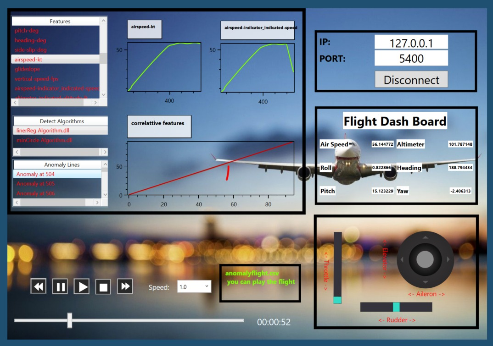

# Flight-Simulator

C# Desktop Application using WPF .NET architecture with MVVM Architecture.

## Description

The application provides the user an interface through which you can connect to a [Flight Gear](https://www.flightgear.org/) app.  <br/>
The application also shows the user updated data in real-time from the flight, including:
* More than 40 different data of aircraft systems
* Detection of anomalies during flight
* Graphical data
* Ability to control data flow rate

## More on the implementation process
The application built in C# using WPF .NET architecture. <br/>
All the algorithms through which the application analyzes and interrogates the flight process built in C++. <br/>
In order for the app to use these algorithms, we have created [DLL's](https://en.wikipedia.org/wiki/Dynamic-link_library) files that allow us to bridge the gap between the different languages and framework.

From the architectural point of view of the application, we used MVVM Architecture - to ensure complete separation between the View and the Model, and used Data Binding between the View and the ViewModel to display the data.

## Tech/framework used

**Built with**
* Visual Studio

*Based on C#, C++*

**Features and tools:**
* MVVM architecture
* Multithreading Programming
* Architectural and design pattern
* Communication and Client-Server Architecture
* OxyPlot - A cross-platform plotting library for .NET

## Documentation files
You can view the UML chart under the folder ```UML```

We provide a short promotional video about the app - you can find it under the folder ```Media```


## Compile and run
To download and set up 'Flight-Simulator' application, follow these steps:
1. Download 'Flight-Simulator' app from GitHub
2. Import the project in Visual studio
3. Run the [Flight-Gear](https://www.flightgear.org/) app
4. Click the connect button and follow the instructions
5. Enjoy!

<p align="center">
   
</p>
 
